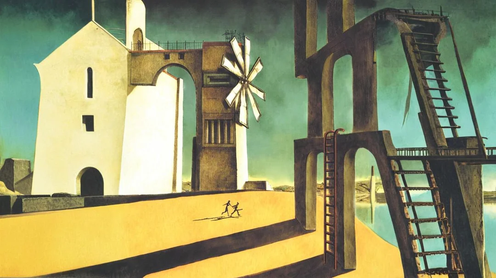

# ICO Reconstruction

> Community research project for documenting and progressively reconstructing ICO for PlayStation 2 as a recompilable technical base.

[](https://github.com/odevpedro/ico-reconstruction/commits/main)
[](./LICENSE)
[](#current-status)



---

ICO Reconstruction is an early-stage community research project focused on understanding and progressively reconstructing **ICO** for PlayStation 2 as a documented, recompilable development base.

The goal is not emulation, piracy, or redistribution of game content. The goal is to study the original PS2 release, document its architecture, build tooling around its data formats and executable code, and eventually make carefully validated technical changes possible.

## Project Goal

This project explores whether ICO can be transformed from a closed PS2 binary into a maintainable reconstruction pipeline:

- ISO and ELF analysis
- asset extraction and documentation
- disassembly and decompilation research
- runtime and subsystem mapping
- tooling for validation and experimentation
- progressive reconstruction of engine, gameplay, camera, actors, animation, collision, events, and scene data

OpenGOAL is an important methodological inspiration, but ICO is not assumed to share OpenGOAL's technical advantages. ICO likely requires a more traditional PS2 reverse engineering workflow over MIPS code, proprietary asset formats, and Team Ico/Sony Japan Studio engine structures.

## Stack & Architecture

This repository is currently documentation-first. The technical stack below describes the intended research workflow rather than a finished application.

| Layer | Current / Intended Tooling |
|-------|-----------------------------|
| Documentation | Markdown |
| Project tracking | `backlog.md`, `system-feature-flows.md`, architectural decision notes |
| ISO inspection | To be defined during environment setup |
| ELF analysis | To be defined during environment setup |
| Disassembly | To be defined during environment setup |
| Asset exploration | To be defined after initial ISO triage |
| Validation | Reproducible notes, binary/asset observations, emulator/debugger evidence where applicable |
| CI/CD | Not configured yet |
| Tests | Not configured yet |

Architectural approach:

```text
user-owned ICO copy
    -> extraction / inspection tools
        -> documented formats and executable regions
            -> subsystem maps
                -> small verified reconstruction targets
                    -> tooling and runtime experiments
```

The project does not currently define a database, backend API, ORM, authentication layer, or web service architecture.

## Current Status

The project is currently in the **planning and architecture phase**.

No reconstructed game code, assets, binaries, or ISO-derived copyrighted data are included in this repository.

Current repository contents are mostly operational documents:

- `backlog.md` - current project state and pending work
- `decisoes-iniciais.md` - initial architectural and process decisions
- `prompt-A-D.md` - architectural analysis prompt for the first major technical pass
- `prompt-E-G.md` - decision matrix and squad architecture prompt
- `fases-2-4.md` - execution templates for later phases
- `system-feature-flows.md` - historical record of implemented flows and decisions

## Repository Structure

```text
.
├── README.md                     # Public entry point for GitHub
├── assets/
│   └── ico-wallpaper.webp        # Public README image
├── backlog.md                    # Current work state and revision signatures
├── decisoes-iniciais.md          # Initial project decisions and retarget history
├── docs/                         # Future technical notes and architecture docs
├── explanation_backlog.md        # Backlog operating rules
├── fases-2-4.md                  # Execution templates for squad specs and reviews
├── prompt-A-D.md                 # First architectural analysis prompt
├── prompt-E-G.md                 # Decision matrix and squad architecture prompt
├── research/                     # Future raw research notes and observations
├── registro_funcionalidades.md   # Feature-flow documentation rules
├── system-feature-flows.md       # Historical record of project flows
├── tests/
│   └── fixtures/                 # Future non-copyrighted parser/tooling fixtures
└── tools/                        # Future scripts and local research utilities
```

## What This Project Is Not

This project is not:

- a PS2 emulator
- a game download
- a source port ready to build
- a mod loader
- a distribution of ICO assets, binaries, or proprietary data
- an attempt to bypass ownership of the original game

Any future tooling should require contributors to provide their own legally obtained copy of the game.

## Local Setup

There is currently no buildable source tree and no runtime to execute.

To work with the repository locally:

```bash
git clone https://github.com/odevpedro/ico-reconstruction.git
cd ico-reconstruction
```

Recommended first reading order:

1. `README.md`
2. `backlog.md`
3. `decisoes-iniciais.md`
4. `prompt-A-D.md`
5. `system-feature-flows.md`

Future setup instructions will be added after the environment setup task defines reproducible tools for ISO inspection, ELF analysis, disassembly, debugging, and asset exploration.

## Tests

No automated test suite exists yet because the repository currently contains planning and research documentation only.

Future tests should focus on:

- deterministic extraction outputs
- known file table parsing cases
- asset format parsing fixtures that do not contain copyrighted data
- checksum or structure validation for user-supplied local files
- regression tests for tooling behavior

## Why ICO?

ICO is an interesting PS2 reconstruction target because it is an early-generation title with a focused design, limited cast, sparse UI, contained environments, and a smaller gameplay surface than many later PS2 AAA games.

At the same time, ICO is still a complex 3D game with proprietary engine technology. Important technical risks include:

- MIPS executable reconstruction
- PS2 vector unit and rendering behavior
- proprietary model, animation, scene, and collision formats
- camera and event scripting
- Yorda companion behavior
- shadow enemy behavior
- room/scene loading
- audio and cutscene systems

The project treats these as research topics, not solved problems.

## Documentation

| Document | Purpose |
|----------|---------|
| [`backlog.md`](./backlog.md) | Current state, pending tasks, completed work, and revision signatures |
| [`decisoes-iniciais.md`](./decisoes-iniciais.md) | Architectural and process decisions |
| [`prompt-A-D.md`](./prompt-A-D.md) | Prompt for the first technical feasibility and roadmap analysis |
| [`prompt-E-G.md`](./prompt-E-G.md) | Prompt for decision matrix, squads, and final recommendation |
| [`fases-2-4.md`](./fases-2-4.md) | Templates for squad specs, roadmap, decision review, and black boxes |
| [`system-feature-flows.md`](./system-feature-flows.md) | Incremental historical record of implemented flows and decisions |
| [`explanation_backlog.md`](./explanation_backlog.md) | Operational rules for backlog updates |
| [`registro_funcionalidades.md`](./registro_funcionalidades.md) | Operational rules for feature-flow documentation |

## Initial Roadmap

1. **Architectural analysis**
   - Define feasibility by subsystem.
   - Identify what can be validated without the game binary and what requires empirical testing.

2. **Environment setup**
   - Establish reproducible tools for ISO inspection, ELF analysis, disassembly, debugging, and asset exploration.

3. **First visible proof of concept**
   - Produce a minimal, documented, non-distributable change from a user-provided copy of ICO.
   - Examples: string, texture, parameter, or simple data mutation.

4. **Subsystem mapping**
   - Map executable regions and data formats.
   - Prioritize actors, rooms, camera, collision, animation, events, and rendering.

5. **Tooling and documentation**
   - Build small tools only when they clarify repeatable workflows.
   - Document every confirmed format, function, and flow.

6. **Progressive reconstruction**
   - Reconstruct small verified pieces first.
   - Avoid large speculative rewrites until enough behavior is understood.

## Project Status

```text
[x] rev.001 - Initial strategic planning and prompt workflow
[x] rev.002 - Project retargeted to ICO Reconstruction
[x] rev.003 - Public README created for community collaboration
[x] rev.004 - README merged with repository template structure
[x] rev.005 - ICO wallpaper added to README
[x] rev.006 - Minimal GitHub folder structure added
[ ] rev.007 - Architectural analysis A-D for ICO
[ ] rev.008 - Architectural analysis E-G for ICO
[ ] pending - Environment setup for extraction and disassembly
[ ] pending - First visible proof of concept against a user-owned copy
```

## How To Contribute

Useful contributions at this stage:

- PS2 reverse engineering notes
- ICO file format observations
- ELF/disassembly analysis
- asset format identification
- documentation improvements
- reproducible tooling suggestions
- references to public PS2 decompilation/reconstruction techniques
- careful issue triage and research summaries

Please do not submit copyrighted assets, game binaries, ISO contents, or decompiled proprietary source copied from commercial material.

Suggested contribution flow:

1. Fork the repository.
2. Create a branch: `git checkout -b research/my-topic`.
3. Make a focused documentation or tooling change.
4. Update `backlog.md` and `system-feature-flows.md` when the change affects project state or technical flow.
5. Commit using Conventional Commits, for example: `docs: document initial ELF observations`.
6. Open a pull request explaining what was observed, how it was validated, and what remains uncertain.

## Suggested Research Areas

- Main ELF structure
- File table and archive formats
- Texture and model formats
- Room/scene data
- Collision data
- Actor/object system
- Animation data
- Camera and event triggers
- Yorda behavior
- Shadow enemy behavior
- Save/progression data
- Audio and cutscene packaging

## Repository Process

This project uses a documentation-first workflow.

Every meaningful contribution should update the relevant project documents:

- update `backlog.md` when work starts, completes, blocks, or creates a new risk
- update `system-feature-flows.md` when a technical flow, tool, or subsystem behavior is documented
- record architectural decisions in `decisoes-iniciais.md` when they affect project direction

Backlog entries use this signature format:

```text
[SQUAD-ID | STATUS | rev.XXX]
```

Common squad IDs:

- `SQUAD-ARCH`
- `SQUAD-RUNTIME`
- `SQUAD-TOOLING`
- `SQUAD-GAMEPLAY`
- `SQUAD-QA`

## Legal Boundary

This repository should contain only original research, documentation, scripts, and clean-room tooling.

Do not upload:

- ICO ISO files
- executable binaries extracted from the game
- copyrighted assets
- proprietary source code
- copyrighted text, audio, video, models, textures, or cutscenes

Any future tools should operate on a local copy supplied by the user.

## License

No license has been selected yet. Until a license is added, assume all rights are reserved for repository contents.

This does not grant rights to ICO, its assets, binaries, trademarks, audio, video, models, textures, scripts, or other proprietary game material.

## Status Summary

ICO Reconstruction is currently a feasibility and planning effort. The next useful milestone is an empirical proof of concept against a user-owned copy of ICO, followed by a subsystem-by-subsystem technical map.

---

Maintained by [@odevpedro](https://github.com/odevpedro) with a documentation-first research workflow.
