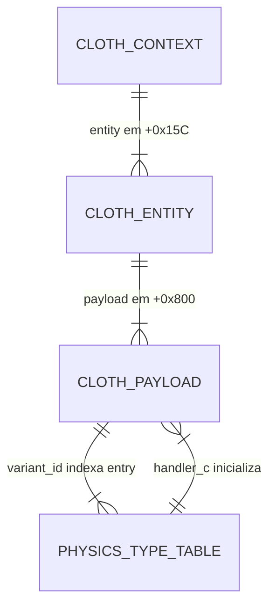

# Data Model — ICO Reconstruction

> Documento vivo do modelo de dados reverso. Atualizado sempre que uma entidade for criada, alterada ou removida.
> **Ultima atualizacao:** 2026-05-16

---

## Indice

- [Visao Geral](#visao-geral)
- [Diagrama ER](#diagrama-er)
- [Entidades](#entidades)
- [Dominio de Valores](#dominio-de-valores)
- [Decisoes de Modelagem](#decisoes-de-modelagem)

---

## Visao Geral

Modelo de dados do sistema de objetos físicos do ICO, focado no subsistema cloth (corda/rope). O núcleo é uma hierarquia de 3 structs (context → entity → payload) mais uma tabela de tipos físicos (31 entries, stride 0x64).

- **Origem:** Engenharia reversa do ELF EE (MIPS R5900, ee-gcc 2.9-991111-01)
- **Nível de confiança:** EXACT ou NEAR-STRUCTURAL para todos os campos documentados (verificados por compilação C contra assembly original)
- **Nomenclatura:** Neutra (field_00, field_40, etc.) até que evidência adicional confirme semântica de gameplay

---

## Diagrama ER

---

## Entidades

### cloth_context

Contexto de frame passado como `a0` para funções cloth.

**Offset base:** passado como argumento (registrador `$a0`)

| Campo | Offset | Tipo | Acesso | Descricao |
|-------|--------|------|--------|-----------|
| `pad_15C` | +0x000 | u8[0x15C] | — | Padding ate entity |
| `entity` | +0x15C | ico_ptr32 | lw | Ponteiro para cloth_entity |
| `entity_alt` | +0x160 | ico_ptr32 | lw | Segundo ponteiro entity (em 0x1D3D40) |
| `extra` | +0x16C | ico_ptr32 | lw | Ponteiro auxiliar (pode ser NULL) |

**Evidencia:** 3 EXACT + 3 NEAR-STRUCTURAL matches (Rev.048)

---

### cloth_entity

Entidade que contém o payload cloth. Parte de uma entidade maior.

**Offset base:** apontado por `cloth_context.entity`

| Campo | Offset | Tipo | Acesso | Descricao |
|-------|--------|------|--------|-----------|
| `pad_000` | +0x000 | u8[0x800] | — | Toda a entidade antes do payload |
| `payload` | +0x800 | ico_ptr32 | lw | Ponteiro para cloth_payload |

---

### cloth_payload

Dados de instância de um objeto cloth/rope. Inicializado por `func_0x001D27A8`.

**Offset base:** apontado por `cloth_entity.payload`

| Campo | Offset | Tipo | Acesso | Descricao |
|-------|--------|------|--------|-----------|
| `field_00` | +0x00 | ico_u32 | lw | Bandeira (testada < 1 para inatividade) |
| `variant_id` | +0x04 | ico_s32 | lw | 0 (area A) ou 1 (area B) da tabela de tipos |
| `flag_08` | +0x08 | ico_u64 | ld | Bandeira 64-bit. zero = ativo |
| `pad_10` | +0x10 | u8[0x30] | — | Gap nao mapeado (dados de pose no runtime) |
| `field_40` | +0x40 | ico_s32 | lw | Retornado quando variant_id == 1 |
| `state_id` | +0x48 | ico_u32 | lw | 0-4, indexa jump table do dispatcher 0x1D37C8 |

**Evidencia:** 3 EXACT matches, runtime confirmacao de `[a1+0x30]` como area ID, `[a1+0x58]` como slot de callback vazio.

---

### physics_type_entry

Entrada na tabela de tipos de objeto físico. Tabela em `0x001A48A0`, stride 0x64, 31 entries.

**Tabela:** `0x001A48A0` (dentro da secao `.text`)
**Stride:** 0x64 (100 bytes)

| Campo | Offset | Tipo | Descricao |
|-------|--------|------|-----------|
| `count` | +0x00 | ico_u32 | Geralmente 1 |
| `handler_a` | +0x04 | ico_ptr32 | Primeiro handler (cleanup/post-dispatch) |
| `pad_08` | +0x08 | ico_ptr32 | Sempre null |
| `handler_b` | +0x0C | ico_ptr32 | Segundo handler (update/callback principal) |
| `pad_10` | +0x10 | ico_ptr32 | Sempre null |
| `handler_c` | +0x14 | ico_ptr32 | Terceiro handler (init/payload init) |
| `pad_18` | +0x18 | ico_u32 | Sempre null |
| `pad_1C` | +0x1C | ico_u32 | Sempre null |
| `name` | +0x20 | char[8] | Nome ASCII (ex: "ROPE\0\0\0\0") |

**Tipos conhecidos:** WOODBOX01, ROTOBJEC, BARREL, ROPE, CHAIN, FLEVER, WLEVER, NONE, CAMERADU, BIRD, GENERATO, CANDLE, MOBJ, CHANDELI, WORM, POOL, DARKVOLU, MCOLTEST, ROPEFIX, CAGE, DYNAMICM, QUEEN, QUEENDEM, CAGEFIX, CLOTHTES

---

### ico_ptr32 (tipo provisorio)

| Propriedade | Valor |
|-------------|-------|
| `typedef` | `int` |
| Uso | Ponteiros internos de 32-bit armazenados em structs |
| Evidencia | 8/8 testes C confirmam lw/sw com int |
| Nao se aplica a | Ponteiros de funcao (DescriptorRecord callbacks) |

---

## Dominio de Valores

### state_id (cloth_payload +0x48)

| Valor | Significado |
|-------|-------------|
| 0 | State block 0 (0x001D3818) no dispatcher |
| 1 | State block 1 (0x001D3844) |
| 2 | State block 2 (0x001D391C) |
| 3 | State block 3 (0x001D39E0) |
| 4 | State block 4 (0x001D3A10) |
| >=5 | Bounds check — cai no guard do dispatcher |

### variant_id (cloth_payload +0x04)

| Valor | Area observada no runtime |
|-------|---------------------------|
| 0 | Entrance, Y=-175 (area A) |
| 1 | Lower level, Y=-1245 (area B) |

---

## Decisoes de Modelagem

### ADR-DM-001 — `ico_ptr32` como `int`

| Campo | Detalhe |
|-------|---------|
| **Status** | Aceita |
| **Data** | 2026-05-16 |
| **Contexto** | O binario EE usa lw/sw (32-bit) para carregar enderecos internos de structs. Se usassemos ponteiros C (`void*`, `uintptr_t`), o GCC geraria ld (64-bit), divergindo do codigo original |
| **Decisao** | `typedef int ico_ptr32` e usar casts explicitos |
| **Alternativas** | `uint32_t` (geraria lwu, nao usado pelo ICO); `void*` (gera ld incorreto) |
| **Consequencias** | Necessario cast em toda leitura/escrita; compilador ee-gcc 2.9 consegue usar ulh/usw com int |

### ADR-DM-002 — Nomenclatura neutra para campos

| Campo | Detalhe |
|-------|---------|
| **Status** | Aceita |
| **Data** | 2026-05-16 |
| **Contexto** | Nomes como "state_id", "flag_08" e "field_40" descrevem comportamento binario, nao semantica de gameplay |
| **Decisao** | Manter nomes neutros ate que evidencia de gameplay confirme semantica |
| **Alternativas** | Nomes especulativos ("is_active", "cloth_type", "animation_state") |
| **Consequencias** | Documento e codigo fonte menos legiveis para leigos, mas evitam conclusao falsa |

### ADR-DM-003 — Entries da tabela de tipos tem stride fixo 0x64

| Campo | Detalhe |
|-------|---------|
| **Status** | Aceita |
| **Data** | 2026-05-16 |
| **Contexto** | Espacamento entre ROTOBJEC (0x1A48A0), BARREL (0x1A4904), ROPE (0x1A4968) e CHAIN (0x1A49CC) e exatamente 0x64 |
| **Decisao** | stride = 0x64 para todas as 31 entries |
| **Alternativas** | Entries com tamanhos variaveis (rejeitado pois quebraria indexacao por ID) |
| **Consequencias** | A funcao iteradora deve fazer `entry = base + index * 0x64` |
