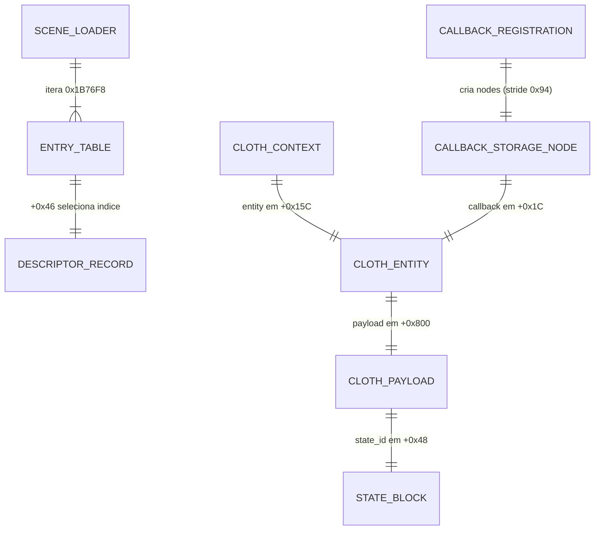

# Data Model — ICO Reconstruction

> Documento vivo do modelo de dados reverso. Atualizado sempre que uma entidade for criada, alterada ou removida.
> **Ultima atualizacao:** 2026-05-16 (Rev.063 — VU0 cloth compute resolved, cloth struct cluster expanded to 48 bytes, 2 writer functions identified)

---

## Indice

- [Visao Geral](#visao-geral)
- [Diagrama ER](#diagrama-er)
- [Entidades](#entidades)
- [Dominio de Valores](#dominio-de-valores)
- [Decisoes de Modelagem](#decisoes-de-modelagem)
- [Anexo: GP-Relative Global Data Map](#anexo-gp-relative-global-data-map)

---

## Visao Geral

Modelo de dados do sistema de objetos físicos do ICO, focado no subsistema cloth (corda/rope). O núcleo é uma hierarquia de 3 structs (context → entity → payload) mais tabelas de descritores (68 entries, stride 0x64) e entries de sala (512 entries, stride 0x4C).

- **Origem:** Engenharia reversa do ELF EE (MIPS R5900, ee-gcc 2.9-991111-01)
- **Nível de confiança:** EXACT ou NEAR-STRUCTURAL para todos os campos documentados (verificados por compilação C contra assembly original)
- **Nomenclatura:** Neutra (field_00, field_40, etc.) até que evidência adicional confirme semântica de gameplay

---

## Diagrama ER



---

## Entidades

### cloth_context

Contexto de frame passado como `a0` para funções cloth.

**Offset base:** passado como argumento (registrador `$a0`)

| Campo | Offset | Tipo | Acesso | Descricao |
|-------|--------|------|--------|-----------|
| `pad_15C` | +0x000 | u8[0x15C] | — | Padding ate entity |
| `entity` | +0x15C | ico_ptr32 | lw | Ponteiro para cloth_entity |
| `entity_alt` | +0x160 | ico_ptr32 | lw | Segundo ponteiro entity (em 0x1D3D40) |
| `extra` | +0x16C | ico_ptr32 | lw | Ponteiro auxiliar (pode ser NULL) |
| `field_08` | +0x08 | ico_s32 | lw | Lido por cloth_payload_init em [s5+0x08] (provavel posicao X) |
| `field_0C` | +0x0C | ico_s32 | lw | Lido por cloth_payload_init em [s5+0x0C] (provavel posicao Z) |

**Evidencia:** 3 EXACT + 3 NEAR-STRUCTURAL matches (Rev.048), confirmado no disassembly de 0x1D27A8 (Rev.050)

---

### cloth_entity

Entidade que contém o payload cloth. Parte de uma entidade maior.

**Offset base:** apontado por `cloth_context.entity`

| Campo | Offset | Tipo | Acesso | Descricao |
|-------|--------|------|--------|-----------|
| `pad_000` | +0x000 | u8[0x78] | — | Inicio da entidade |
| `field_78` | +0x078 | ico_s32 | sw | Zerado por cloth_payload_init |
| `pad_07C` | +0x07C | u8[0x784] | — | Ate o payload |
| `payload` | +0x800 | ico_ptr32 | lw,sw | Ponteiro para cloth_payload |
| `field_814` | +0x814 | ico_s32 | sw | Escrito em 0x1B76F8 a partir de `entry[+0x30]` |

---

### cloth_payload

Dados de instância de um objeto cloth/rope. Inicializado por `func_0x001D27A8`.

**Offset base:** apontado por `cloth_entity.payload`

| Campo | Offset | Tipo | Acesso | Descricao |
|-------|--------|------|--------|-----------|
| `field_00` | +0x00 | ico_u32 | lw | Bandeira (testada < 1 para inatividade) |
| `variant_id` | +0x04 | ico_s32 | lw | 0 (area A) ou 1 (area B) — controla init path em 0x1D27A8 |
| `flag_08` | +0x08 | ico_u64 | ld | Bandeira 64-bit. zero = ativo |
| `pad_10` | +0x10 | u8[0x30] | — | Gap nao mapeado (dados de pose no runtime) |
| `field_40` | +0x40 | ico_s32 | lw | Preenchido com retorno de 0x1B7FE8 quando variant == 1 |
| `field_44` | +0x44 | ico_s32 | sw/lw | Timer/counter (decrementado em state 1 do dispatcher) |
| `state_id` | +0x48 | ico_u32 | lw | 0-4, indexa jump table do dispatcher 0x1D37C8 |
| `matrix_ptr` | +0x50 | ico_ptr32 | sw | Ponteiro para matriz de transform (state 2) |
| `result_ptr` | +0x60 | ico_ptr32 | sw | Ponteiro para resultado allocado (state 2 via 0x12A618) |
| `field_64` | +0x64 | ico_u32 | sw | Flag de fase (1=state 0 ativo, 0=state 2 limpa, 4=state 3 completa) |

**Evidencia:** 3 EXACT matches, runtime confirmacao de `[a1+0x30]` como area ID, `[a1+0x58]` como slot de callback vazio. `field_40` e `field_44` confirmados no disassembly de 0x1D27A8 (Rev.050).

---

### ~~physics_type_entry~~ REMOVIDO

**A tabela de tipos físicos anteriormente documentada em 0x001A48A0 foi REMOVIDA (Rev.059).** O endereço 0x1A48A0 está dentro da seção `.text` (0x100000–0x26F5D4) e decodifica como código MIPS, não como tabela de dados.

As tabelas reais que cumprem o papel da antiga "physics type table" são:

| Tabela | VA | Seção | Stride | Entries |
|--------|-----|-------|--------|---------|
| Entry table | 0x002A4C48 | .data | 0x4C (76) | 512 |
| Descriptor table | 0x002A31B8 | .data | 0x64 (100) | 68 |

Os nomes de tipo (WOODBOX01, ROTOBJEC, BARREL, ROPE, etc.) fazem parte do campo `name` (+0x00) do descritor, não de uma tabela separada.

---

### descriptor_record

Entrada na tabela de descritores (descriptor table). Tabela em `0x002A31B8`, stride 0x64.

**Tabela:** `0x002A31B8` (secao `.data`)
**Stride:** 0x64 (100 bytes)

| Campo | Offset | Tipo | Descricao |
|-------|--------|------|-----------|
| `name` | +0x00 | char[4-8] | Nome ASCII, 4-8 bytes null-padded |
| `phy_type` | +0x20 | u8 | Tipo de constraint fisico (0xF1=lever, 0xF2=woodbox, 0xF3=barrel, 0=generic) |
| `scale` | +0x28 | float | Escala fisica (1.0=active, 0.0=inactive) |
| `damping` | +0x2C | float | Damping/gravity (0.01=physics, 0.0=inert) |
| `count` | +0x30 | u32 | Limite de instancias |
| `init_fn` | +0x40 | ico_ptr32 | **Constructor/asset init** (0 = sem modelo dedicado) |
| `flags` | +0x44 | u32 | 1=active, 0=inactive |
| **hA** | **+0x48** | **ico_ptr32** | **Post-init/Reset handler** |
| (pad) | +0x4C | u32 | Zero |
| **hB** | **+0x50** | **ico_ptr32** | **Update per-frame handler** |
| (pad) | +0x54 | u32 | Zero |
| **hC** | **+0x58** | **ico_ptr32** | **Constructor/Init handler** (chamado por 0x1B76F8) |
| (pad) | +0x5C | u32 | Zero |

**Convencao de handlers (confirmada em 7 entidades, Rev.053-054):**

| Slot | Papel | Detalhes |
|------|-------|----------|
| **hC (+0x58)** | Constructor | Aloca heap via 0x13A0F8, init estado interno. Chamado pelo iterador 0x1B76F8 |
| **hB (+0x50)** | Update per-frame | Despachado em runtime. Contem colisao, AI, animacao, desenho |
| **hA (+0x48)** | Post-init / Reset | Chamado condicionalmente. Cleanup, reset de estado |
| **init_fn (+0x40)** | Asset init | Carrega modelos 3D, configura DMA. Chamado pelo sistema de assets |

**Indices conhecidos (Rev.056 — scan completo de 68 entries, indices corrigidos):**

| Indice | Label | init_fn (+0x40) | hA (+0x48) | hB (+0x50) | hC (+0x58) | Alloc hC | Status |
|--------|-------|-----------------|-------------|-------------|-------------|----------|--------|
| 1 | BOY | 0x153478 | 0x1C1F58 | 0x1C1DD8 | 0x1C1A98 | ? | ASM |
| 2 | GIRL | 0x174BA0 | 0x1D1A98 | 0x1D17F8 | 0x1D1668 | 64B | ASM |
| 4 | ENEMY1 | 0x164440 | 0x1CE690 | 0x1CE3C0 | 0x1CE220 | 80B | ASM |
| 17 | WOODBOX0 | 0x17D1D0 | 0x1C05D0 | 0x1C0538 | 0x1C00C0 | 400B | ASM |
| 19 | BARREL | 0 | 0x1D3B28 | 0x1D3A30 | 0x1D27A8 | ~40B | CLOTH |
| 20 | ROPE | 0 | 0x1E9630 | 0x1E9810 | 0x1E8F38 | — | OVERLAY |
| 30 | BGA | 0x203EE8 | 0 | 0 | 0 | 0 | ASM |
| 32 | BIRD | 0x1971C0 | 0x197080 | 0x197078 | 0x197240 | 64B | NEAR |
| 46 | QUEEN | 0x19B7F8 | 0x19A9A0 | 0x19A8F0 | 0x19A7E8 | 24B | NEAR |
| 48 | DEVIL_GI | 0x174BA0 | 0x1D1A98 | 0x1D17F8 | 0x1D1668 | 64B | ALIAS |
| 61 | AP1 | 0x1BB6B0 | 0x1BA530 | 0x1BA330 | 0x1B8720 | 640B | ASM |
| 62 | ATTACKCH | 0x1BBF78 | 0x1BBEC8 | 0x1BBEA0 | 0x1BBE50 | 12B | NEAR |
| 63 | ATTACKCH | 0x1BBF78 | 0x1BBE48 | 0x1BBDD8 | 0x1BBB20 | dyn*8 | ASM |
| 64 | BOSS_CTR | 0x198140 | 0x198000 | 0x197FC8 | 0x198218 | 0 | ASM |

**13 entradas com init_fn nao-nulo:** BOY, GIRL, ENEMY1, WOODBOX0, BGA, BIRD, QUEEN, DEVIL_GI, AP1, ATTACKCH x2, BOSS_CTR
**10 enderecos unicos init_fn:** GIRL/DEVIL_GI compartilham 0x174BA0, ATTACKCH 62/63 compartilham 0x1BBF78

**Observacao:** BARREL (idx 19) e ROPE (idx 20) sao descritores diferentes, mas na tabela de tipos fisicos (0x001A48A0) ambos aparecem com os mesmos handlers. Rev.056 corrigiu indices de varios descritores: WOODBOX0=17 (era 6), BGA=30 (era 50), AP1=61 (era 56).

---

### entry_table

Tabela de entries de objetos por sala/zona. Tabela em `0x002A4C48`, stride 0x4C.

**Tabela:** `0x002A4C48` (secao `.data`)
**Stride:** 0x4C (76 bytes)

| Campo | Offset | Tipo | Descricao |
|-------|--------|------|-----------|
| `pos_x` | +0x00 | float | Posicao X (quase sempre 1.0f padrao) |
| `pos_y` | +0x04 | float | Posicao Y |
| `pos_z` | +0x08 | float | Posicao Z |
| `rot` | +0x0C | float | Rotacao/angulo |
| `scale_a` | +0x10 | float | Escala/parametro A |
| `scale_b` | +0x14 | float | Escala/parametro B |
| `unk_18` | +0x18 | float | Transform field |
| `unk_1C` | +0x1C | float | Transform field |
| `unk_20` | +0x20 | float | Transform field |
| `callback_override` | +0x24 | ico_ptr32 | Callback override (0 = usa descriptor) |
| `unk_28` | +0x28 | ico_s32 | Desconhecido |
| `param_2C` | +0x2C | ico_s32 | Parametro numerico (0x5eb, 0x15, etc) |
| `param_30` | +0x30 | ico_s32 | Parametro numerico (copiado para [entity+0x814]) |
| `unk_34` | +0x34 | ico_s32 | Desconhecido |
| `unk_38` | +0x38 | ico_s32 | Desconhecido |
| `unk_3C` | +0x3C | ico_s32 | Desconhecido |
| `flags_hi` | +0x40 | u16 | Halfword de flags/shift |
| `unk_42` | +0x42 | u16 | Desconhecido |
| `unk_44` | +0x44 | u16 | Geralmente 0 |
| `descriptor_idx` | +0x46 | u8 | **Indice do descriptor** (mais importante!) |
| `subtype` | +0x47 | u8 | Byte de subtipo (mascara 0x1f) |
| `flags` | +0x48 | ico_u32 | Flags/mask (0x0011FFFF padrao) |

**Indices mapeados:**

| +0x46 | Label | Entries encontradas |
|---|---|---|
| 0x01 | BOY | 2 |
| 0x02 | GIRL | 2 |
| 0x07 | idx_07 | ~60 (objetos pequenos) |
| 0x0A | idx_0A | ~40 (objetos comuns) |
| 0x0E | idx_0E | ~15 |
| 0x13 | **BARREL** | **24+ (objetos cloth)** |
| 0x15 | CHAIN | 5 |
| 0x16 | FLEVER | 4 |
| 0x1C | CAMERADUMMY | ~30 |
| 0x1E | BGA | ~80 (background animations) |
| 0x2C | idx_2C | ~20 |

---

### cloth_state_block

Sub-bloco dentro de cloth_payload (offset +0x40). Contém estado local do dispatcher de 5 estados.

**Offset base:** `payload + 0x40` (referenciado como `s1` no dispatcher)

| Campo | Offset absoluto | Offset relativo a s1 | Tipo | Acesso | Descricao |
|-------|-----------------|----------------------|------|--------|-----------|
| `field_40` | payload+0x40 | +0x00 | ico_ptr32 | lw | Passado para guard function 0x1F2148 |
| `counter` | payload+0x44 | +0x04 | ico_s32 | sw/lw | Timer decrementado em state 1; quando 0 → state 2 |
| `state_id` | payload+0x48 | +0x08 | ico_u32 | lw | 0-4, seleciona handler no dispatcher 0x1D37C8 |
| `matrix` | payload+0x50 | +0x10 | ico_ptr32 | — | Workspace de matriz (state 2) |
| `result` | payload+0x60 | +0x20 | ico_ptr32 | sw | Result struct allocado (state 2, via 0x12A618) |

**State machine (Rev.057):**

```
State Flow: 0 → 1 → 2 → 3 → 4 (terminal). External code resets state to 0.

State 0 (GUARD, 0x1D3818):
  - Chama 0x1F2148(field_40, ctx)
  - Se retornar != 0: setup_1, setup_2, flag=1, state=1
  - Se retornar 0: exit (state fica 0)

State 1 (PREPARE/TIMING, 0x1D3844):
  - Copia quaternion seed de 0x4C4750 para stack
  - Calculo com dados de 0x274EC0/0x274EC4 (timing params)
  - ee_sqrt, ee_atan2, ee_cos para compute force
  - Copia quaternion resultante para [entity_state+0xA0]
  - counter--; se 0: state=2

State 2 (SIMULATE, 0x1D391C):
  - Limpa [payload+0x64]
  - CD functions (0x12ABE0/0x12AC28/0x12ADE8/0x12A618)
  - Matrix init + entity callback (0x181BF8)
  - cloth_phase_2 (0x1D12D8)
  - Alloca result struct, init quat, copy data de 0x276140
  - state=3

State 3 (CHECK, 0x1D39E0):
  - Chama 0x12A7F8(result_ptr)
  - Se pass: state=4, [payload+0]=1, [ctx+0x16C]=0
  - Se fail: retry (state fica 3)

State 4 (IDLE):
  - No-op. Epilogo direto
```

---

### callback_storage_node

Node de lista ligada usado pelo sistema de registro de callbacks. Gerenciado por `0x13F3F0` (576 bytes, stride 0x94).

**Offset base:** apontado por `entity_or_context + 0x10` (head da lista)

| Campo | Offset | Tamanho | Tipo | Descricao |
|-------|--------|---------|------|-----------|
| `next` | +0x00 | 8 | ico_ptr64 | Proximo node na lista ligada (ld/sd) |
| `data` | +0x08 | 4 | ico_ptr32 | Ponteiro para dados do callback |
| `type` | +0x0C | 4 | ico_u32 | Tipo do callback (ex: 0x13 = cloth) |
| `body` | +0x10 | 0x84 | u8[132] | Corpo do node (allocado separadamente) |

**Stride total:** 0x94 (148 bytes)

**Behavior (Rev.059):**
- `0x13F7A8(a0=obj, a1=data, a2=type, a3=&spill)`: wrapper que chama 0x13F3F0 duas vezes
  - Primeira: a0 = obj (callback na lista principal)
  - Segunda: a0 = obj+0x10 (sister callback storage)
- `0x13F7D8()`: variante sem contexto, a0=0x194, a1=0, t1=0x1800
- `0x13F3F0()`: busca linear (max 3 nodes). Se não encontra: alloc via 0x1A6E28
- Fallback: se alloc falha, armazena em `[obj+0x1C]` diretamente (mesmo offset de ThreadParam.entry no EE SDK)
- Runtime confirmou 1249 chamadas, todas com a3=0x13, 10 data pointers distintos (Rev.051)

---

| Propriedade | Valor |
|-------------|-------|
| `typedef` | `int` |
| Uso | Ponteiros internos de 32-bit armazenados em structs |
| Evidencia | 8/8 testes C confirmam lw/sw com int |
| Nao se aplica a | Ponteiros de funcao (DescriptorRecord callbacks) |

---

## Dominio de Valores

### state_id (cloth_payload +0x48)

| Valor | Handler | Fase | Descricao |
|-------|---------|------|-----------|
| 0 | 0x001D3818 | GUARD | Check condition. Se pass: setup, state→1 |
| 1 | 0x001D3844 | PREPARE/TIMING | Quaternion seed, counter--. Quando 0: state→2 |
| 2 | 0x001D391C | SIMULATE | Matrix, CD functions, result alloc, entity callback. state→3 |
| 3 | 0x001D39E0 | CHECK | Verifica resultado. Se ok: state→4, cleanup. Se nao: retry |
| 4 | 0x001D3A10 | IDLE/DONE | No-op. Algo externo reseta state para 0 |
| >=5 | — | INVALIDO | Bounds check → executa state 0 guard |

### variant_id (cloth_payload +0x04)

| Valor | Area observada no runtime |
|-------|---------------------------|
| 0 | Entrance, Y=-175 (area A) |
| 1 | Lower level, Y=-1245 (area B) |

---

## Decisoes de Modelagem

### ADR-DM-001 — `ico_ptr32` como `int`

| Campo | Detalhe |
|-------|---------|
| **Status** | Aceita |
| **Data** | 2026-05-16 |
| **Contexto** | O binario EE usa lw/sw (32-bit) para carregar enderecos internos de structs. Se usassemos ponteiros C (`void*`, `uintptr_t`), o GCC geraria ld (64-bit), divergindo do codigo original |
| **Decisao** | `typedef int ico_ptr32` e usar casts explicitos |
| **Alternativas** | `uint32_t` (geraria lwu, nao usado pelo ICO); `void*` (gera ld incorreto) |
| **Consequencias** | Necessario cast em toda leitura/escrita; compilador ee-gcc 2.9 consegue usar ulh/usw com int |

### ADR-DM-002 — Nomenclatura neutra para campos

| Campo | Detalhe |
|-------|---------|
| **Status** | Aceita |
| **Data** | 2026-05-16 |
| **Contexto** | Nomes como "state_id", "flag_08" e "field_40" descrevem comportamento binario, nao semantica de gameplay |
| **Decisao** | Manter nomes neutros ate que evidencia de gameplay confirme semantica |
| **Alternativas** | Nomes especulativos ("is_active", "cloth_type", "animation_state") |
| **Consequencias** | Documento e codigo fonte menos legiveis para leigos, mas evitam conclusao falsa |

---

## Anexo: GP-Relative Global Data Map

**GP = 0x006388F0** (confirmado do boot code em `0x100034-0x10005C`)

**Seccoes acessiveis via GP (`$28`):**

| Seccao | VA | Tamanho | GP offset range | Tipo |
|--------|-----|---------|-----------------|------|
| `.lit4` | 0x00630900 | 0xFD0 | -32752 a -28708 | Float constant pool (LWC1/SWC1, read-only) |
| `.sdata` | 0x00631900 | 0x22C6 | -28596 a -18960 | Initialized small data (853 vars, 8.669 acc) |
| `.sbss` | 0x00633C00 | 0x3F4 | -18960 a -18588 | Uninitialized small data (248 vars, 1.831 acc) |

**Variaveis globais mapeadas:**

| GP offset | VA | Secao | Acessos | Escritores | Provavel uso |
|-----------|-----|-------|---------|------------|-------------|
| -28172 | 0x00631AE4 | .sdata+0x1E4 | 1.260 | descriptor_iteration | `girl_obj_ptr` — ponteiro para entidade GIRL |
| -28168 | 0x00631AE8 | .sdata+0x1E8 | 986 | descriptor_iteration | `other_obj_ptr` — ponteiro para segunda entidade (BOY?) |
| -28164 | 0x00631AEC | .sdata+0x1EC | 113 | scene_loader_approx | `obj_ptr_2` |
| -18868 | 0x00633F3C | .sbss+0x33C | 434 | ? | Cloth vertex/state pointer (runtime) |
| -28544 | 0x00631970 | .sdata+0x070 | 160 | — | `state_field_2` |
| -28512 | 0x00631990 | .sdata+0x090 | 139 | descriptor_iteration | `world_state` — flag de estado global |
| -23604 | 0x00632CBC | .sdata+0x13BC | 150 | print_stub_disabled | `texture_flag` |
| -26388 | 0x006321DC | .sdata+0x8DC | 62 | callback_system_reg | `callback_system_state` |
| -21424 | 0x00633540 | .sdata+0x1C40 | 52 | seeker_update | `seeker_state` |
| -19528 | 0x00633CA8 | .sbss+0x0A8 | 4 | node_callback_storage | `pool_base` |
| -19524 | 0x00633CAC | .sbss+0x0AC | 4 | node_callback_storage | `pool_capacity` |

**Clusters de structs:**

**Object Pointer Array** (gp[-28176..-28152], 6 ponteiros × 4B):
- -28176: `obj_ptr_0` (2 acc)
- -28172: `girl_obj_ptr` **HOT** (1.260 acc)
- -28168: `other_obj_ptr` **HOT** (986 acc)
- -28164: `obj_ptr_2` (113 acc)
- -28160: `obj_ptr_3` (8 acc)
- -28156: `obj_ptr_4` (3 acc)

**Callback/Event System** (.sbss+0x0A0..+0x0D0):
- -19536: `event_flag` (17 acc)
- -19528: `pool_base` (4 acc, writer: node_callback_storage)
- -19524: `pool_capacity` (4 acc, writer: node_callback_storage)
- -19520: `event_feedback_state` (9 acc, writer: event_feedback)

**Cloth System Struct Cluster** (.sbss+0x324..+0x364, 48 bytes, 12 slots, 2 writers):

| Offset | GP offset | Writer (scene 0x1DFBC8) | Writer (entity 0x1E00F8) | Reader (0x1D8E40) | Acesso total |
|---|---|---|---|---|---|
| `.sbss+0x324` | -18892 | sim | sim | — | — |
| `.sbss+0x328` | -18888 | sim | — | — | — |
| `.sbss+0x32C` | -18884 | — | sim | — | — |
| `.sbss+0x330` | -18880 | sim | — | — | — |
| `.sbss+0x334` | -18876 | sim | — | — | — |
| `.sbss+0x338` | -18872 | sim | sim | — | — |
| `.sbss+0x33C` | **-18868** | **sim** | **sim** | **7×** | **434 (MAIS ACESSADO)** |
| `.sbss+0x340` | **-18864** | **sim** | **sim** | **7×** | **117** |
| `.sbss+0x344` | -18860 | — | sim | — | — |
| `.sbss+0x348` | -18856 | sim | — | — | — |
| `.sbss+0x350` | -18848 | — | — | — | — |
| `.sbss+0x354` | -18844 | sim | — | — | — |

**Writers:** 0x1DFBC8 (scene init, 12 GP vars) + 0x1E00F8 (entity init, 8 GP vars). Ambos estão FORA do range clothAnimation.c (0x1D27A8-0x1D45B0).

**Function 0x1D8E40** (VU0 cloth render/compute, 295 insns, 656B stack, 20 JALs): acessa gp[-18868] e gp[-18864] em 2 blocos de VU0 kernel. Fora do range clothAnimation.c. Ver `research/elf/ghidra-rev063-vu0-cloth-compute-and-writer-functions.md`.

**Init values nao-zero em .sdata:** 40 entity type tags (OBJ, BGA, ENE, ICO, CAM, ACT, etc.), format strings `"%s : %s"` / `"%s : %d"`, texture format names (PSMCT32, PSMT8, etc.), GS texture params (SELTEX, SCRL-U, SHINE, etc.), funcao pointer `0x001D9020` (cloth VU0 SIMD), e 0xFFFFFFFF sentinelas.

**Init values no cluster callback** (.sdata+0x8E8..0x908):
| Offset | Valor | Significado |
|--------|-------|-------------|
| gp-26376 | 0x00000001 | count/ID |
| gp-26368 | 0x00000030 | 48 (size?) |
| gp-26360 | 0x000A7325 | packed config |
| gp-26352 | 0x00005010 | packed config |
| gp-26348 | **0x001D9020** | **Function pointer (VU0 cloth SIMD)** |
| gp-26344 | 0x0000000A | 10 (count?) |

> Fonte: `research/elf/ghidra-rev062-gp-relative-data-map.md`

---

### ADR-DM-003 — Entries da tabela de tipos tem stride fixo 0x64

| Campo | Detalhe |
|-------|---------|
| **Status** | Aceita |
| **Data** | 2026-05-16 |
| **Contexto** | Espacamento entre ROTOBJEC (0x1A48A0), BARREL (0x1A4904), ROPE (0x1A4968) e CHAIN (0x1A49CC) e exatamente 0x64 |
| **Decisao** | stride = 0x64 para todas as 31 entries |
| **Alternativas** | Entries com tamanhos variaveis (rejeitado pois quebraria indexacao por ID) |
| **Consequencias** | A funcao iteradora deve fazer `entry = base + index * 0x64` |
